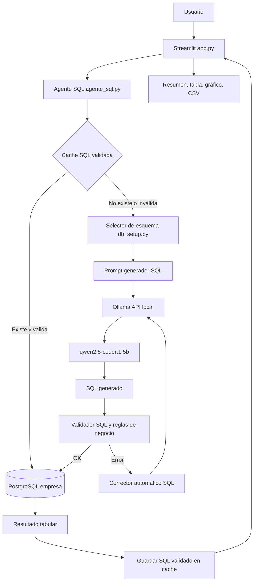
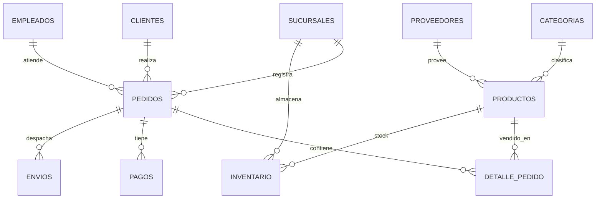

# Agente Analítico Empresarial SQL

Proyecto de agente conversacional local que recibe preguntas en lenguaje natural, genera SQL PostgreSQL, valida la consulta contra un modelo de datos empresarial, corrige errores frecuentes de forma automática, ejecuta la consulta y muestra el resultado en una interfaz web.

La solución está pensada como una demostración profesional de un agente IA aplicado a analítica empresarial, manteniendo todo el procesamiento en local: modelo LLM, base de datos, cache y aplicación web.

---

## 1. Objetivo del Proyecto

El objetivo es demostrar cómo un usuario de negocio puede consultar una base de datos relacional sin escribir SQL.

Ejemplo:

```text
Usuario: Top 5 clientes por ingresos
Sistema:
1. Entiende la intención de negocio.
2. Selecciona tablas relevantes.
3. Genera SQL PostgreSQL.
4. Valida seguridad, columnas, aliases y reglas de negocio.
5. Corrige automáticamente si detecta inconsistencias.
6. Ejecuta la consulta en PostgreSQL.
7. Presenta el resultado en una interfaz tipo chat.
```

El proyecto no busca reemplazar un BI completo, sino demostrar un patrón moderno de arquitectura:

```text
Lenguaje natural + LLM local + validación determinística + base de datos empresarial + UX analítica
```

---

## 2. Funcionalidades Principales

### 2.1 Consulta en Lenguaje Natural

El usuario escribe preguntas como:

```text
Top 5 productos con mayores ventas
Ventas totales por ciudad del cliente
Categorías más rentables por ingresos
Pedidos por canal y estado
Productos con stock por debajo del mínimo
```

El sistema genera una consulta SQL equivalente y la ejecuta.

### 2.2 Generación Dinámica de SQL

La consulta SQL no está hardcodeada. El modelo local `qwen2.5-coder:1.5b`, ejecutado con Ollama, genera SQL a partir de:

- Pregunta del usuario.
- Esquema relevante.
- Relaciones entre tablas.
- Diccionario de datos.
- Reglas de negocio.
- Intentos previos fallidos, si existieran.

### 2.3 Validación de Seguridad

Antes de ejecutar cualquier SQL, el sistema valida que:

- Empiece con `SELECT`.
- Contenga `FROM`.
- No use instrucciones peligrosas como `DROP`, `DELETE`, `UPDATE`, `INSERT`, `ALTER`, `TRUNCATE` o `CREATE`.
- Use tablas existentes.
- Use columnas existentes.
- Use aliases definidos.
- Cumpla reglas de negocio mínimas.

Esto evita que el modelo ejecute instrucciones destructivas o invente columnas.

### 2.4 Diccionario de Datos de Negocio

El agente no solo conoce tablas y columnas. También recibe significado de negocio:

- `pagos.monto` representa dinero pagado.
- `detalle_pedido.precio_unitario` representa precio de venta por línea.
- `productos.costo` se usa para calcular margen.
- `pedidos.canal` representa el canal comercial.
- `pedidos.estado` representa estado del pedido.

Esto ayuda al modelo a elegir mejor las métricas.

### 2.5 Autocorrección Automática

Si el SQL generado falla o no cumple una regla, el agente no muestra el error inmediatamente. Primero intenta corregirse.

Ejemplos de correcciones:

- Cambiar `dp.pagamento_id` por la relación correcta `pa.pedido_id = pe.id`.
- Corregir `pe.pa.monto` por `pa.monto`.
- Eliminar `JOIN`s innecesarios.
- Añadir `ORDER BY` cuando la pregunta pide ranking.
- Recalcular rentabilidad usando `productos.costo`.

### 2.6 Memoria Cache Validada

Cuando una pregunta genera una consulta SQL válida, se guarda en `cache_sql.sqlite3`.

La próxima vez que el usuario haga la misma pregunta:

```text
Pregunta repetida -> cache SQL validado -> PostgreSQL -> respuesta rápida
```

Esto reduce tiempos de respuesta, especialmente importante en equipos con CPU limitada.

Importante: la cache se valida nuevamente antes de usarse. Si cambian las reglas de negocio y una consulta antigua ya no cumple, se descarta.

### 2.7 Interfaz Web

La interfaz está construida con Streamlit y ofrece:

- Campo de pregunta en lenguaje natural.
- Preguntas sugeridas.
- KPIs generales.
- Botón `Consultar`.
- Botón `Nueva conversación`.
- Botón `Cargar demo`.
- Historial tipo chat.
- Tiempo total.
- Métricas internas del agente.
- Tabla de resultados.
- Gráfico automático.
- Descarga CSV.
- SQL técnico oculto en un expander.

---

## 3. Arquitectura de la Solución

### 3.1 Diagrama General



### 3.2 Flujo Interno Detallado

1. El usuario escribe una pregunta en `app.py`.
2. `app.py` llama a `procesar_pregunta()` en `agente_sql.py`.
3. El agente normaliza la pregunta.
4. Busca una consulta SQL validada en memoria local o en SQLite.
5. Si encuentra una consulta en cache:
   - La valida nuevamente.
   - La ejecuta en PostgreSQL.
   - Devuelve el resultado.
6. Si no hay cache válida:
   - Llama a `construir_contexto_esquema()` en `db_setup.py`.
   - Selecciona tablas y relaciones relevantes.
   - Construye el prompt del generador SQL.
   - Envía el prompt a Ollama.
   - Limpia y normaliza la respuesta del modelo.
   - Valida la consulta.
7. Si la consulta falla:
   - Construye un prompt corrector.
   - Incluye SQL fallido, error detectado, esquema y diccionario de datos.
   - Vuelve a llamar al modelo.
   - Aplica reparaciones determinísticas.
   - Valida otra vez.
8. Si la consulta queda válida:
   - Ejecuta en PostgreSQL.
   - Guarda en cache.
   - Retorna filas, columnas, SQL, origen, tiempos y validaciones.
9. `app.py` convierte el resultado a DataFrame.
10. La interfaz muestra resumen ejecutivo, tabla, gráfico y detalle técnico.

---

## 4. Justificación Técnica de la Arquitectura Local

### 4.1 Por Qué un Modelo Local

Se eligió una arquitectura local por estos motivos:

- Privacidad: los datos empresariales no salen de la máquina.
- Bajo costo: no hay pago por token.
- Control: se puede auditar el SQL antes de ejecutarlo.
- Demo reproducible: funciona sin depender de una API cloud externa.
- Latencia predecible después de cache: las preguntas repetidas responden muy rápido.

### 4.2 Por Qué Ollama

Ollama se usa como runtime local del modelo porque:

- Expone una API HTTP local simple en `http://localhost:11434/api/generate`.
- Permite cambiar modelos fácilmente.
- Es sencillo de instalar y operar en una demo.
- Permite mantener modelos cargados con `keep_alive`.
- Tiene buen soporte comunitario y catálogo amplio.
- Funciona bien como servidor local para prototipos y agentes.

En el proyecto se usa:

```python
URL_OLLAMA = "http://localhost:11434/api/generate"
MODELO_SQL = "qwen2.5-coder:1.5b"
OLLAMA_KEEP_ALIVE = "30m"
```

La opción `keep_alive` permite mantener el modelo cargado durante un tiempo para reducir el costo de carga entre consultas.

Referencia oficial:

- Ollama API: https://github.com/ollama/ollama/blob/main/docs/api.md
- Ollama `keep_alive`: https://github.com/ollama/ollama/blob/main/docs/faq.mdx

### 4.3 Por Qué qwen2.5-coder:1.5b

Se eligió `qwen2.5-coder:1.5b` porque el equipo de desarrollo es un Mac Intel, sin aceleración Metal moderna como Apple Silicon.

Ventajas para este contexto:

- Tamaño pequeño.
- Menor consumo de RAM que modelos de 7B.
- Mejor orientación a código/SQL que modelos conversacionales generales pequeños.
- Permite correr 100% local.
- Es suficientemente capaz para generar SQL si se le da buen contexto.

Limitaciones:

- Puede omitir detalles como `ORDER BY`.
- Puede mezclar conceptos de negocio si la pregunta es ambigua.
- No debe ejecutarse sin validadores.
- Requiere prompts estrictos y corrección automática.

Por eso el diseño no confía ciegamente en el modelo. El LLM propone; el sistema valida.

### 4.4 Por Qué No Foundry Local en Esta Versión

Foundry Local es una alternativa interesante para inferencia local. Según la documentación de Microsoft, está orientado a aplicaciones on-device, usa un catálogo curado de modelos, SDKs y ONNX Runtime, con aceleración automática cuando el hardware lo permite.

Sin embargo, para este proyecto se eligió Ollama por razones prácticas:

1. **Madurez para prototipado rápido**
   Ollama permite instalar, descargar modelos y exponer una API local con muy poca configuración.

2. **Simplicidad de integración**
   El proyecto solo necesita hacer un `POST` a una API local. No necesita SDK específico ni integración más profunda.

3. **Catálogo amplio y flexible**
   Ollama permite probar rápidamente modelos como Qwen, Llama, Mistral u otros.

4. **Menor fricción para demo académica/empresarial**
   Para una presentación, es más fácil explicar y reproducir:

   ```bash
   ollama pull qwen2.5-coder:1.5b
   ollama serve
   ```

5. **Foundry Local está orientado a producto embebido**
   Foundry Local es fuerte para aplicaciones finales que empaquetan inferencia local dentro de la app. Este proyecto, en cambio, es un prototipo analítico con servidor local, PostgreSQL y Streamlit.

6. **Foundry Local aún está en preview**
   La documentación indica que Foundry Local está en preview, por lo que APIs o comportamientos podrían cambiar antes de GA.

Conclusión:

```text
Ollama es mejor elección para este prototipo local, educativo y demostrable.
Foundry Local podría evaluarse en una fase posterior si se quiere empaquetar el agente como aplicación empresarial on-device.
```

Referencias:

- Foundry Local overview: https://learn.microsoft.com/en-us/azure/ai-foundry/foundry-local/what-is-foundry-local
- Foundry Local architecture: https://learn.microsoft.com/en-us/azure/ai-foundry/foundry-local/concepts/foundry-local-architecture
- Foundry Local get started: https://learn.microsoft.com/en-us/azure/ai-foundry/foundry-local/get-started

---

## 5. Componentes Técnicos

### 5.1 PostgreSQL

Base de datos relacional empresarial.

Se levanta con Docker:

```yaml
POSTGRES_USER: admin
POSTGRES_PASSWORD: admin
POSTGRES_DB: empresa
```

Puerto:

```text
5432
```

### 5.2 Docker Compose

Archivo:

```text
docker-compose.yml
```

Define un servicio PostgreSQL 15:

```yaml
services:
  db:
    image: postgres:15
    container_name: proyecto_ia_db
```

Uso:

```bash
docker compose up -d
```

### 5.3 Ollama

Runtime local del LLM.

Comandos típicos:

```bash
ollama serve
ollama pull qwen2.5-coder:1.5b
ollama list
```

### 5.4 qwen2.5-coder:1.5b

Modelo principal para generación y corrección SQL.

Uso:

- Generador SQL.
- Corrector SQL.
- Reparación de queries fallidas.

### 5.5 SQLite Cache

Archivo:

```text
cache_sql.sqlite3
```

Guarda preguntas normalizadas y SQL validado.

Tabla:

```sql
CREATE TABLE IF NOT EXISTS sql_cache (
    pregunta TEXT PRIMARY KEY,
    sql TEXT NOT NULL,
    modelo TEXT NOT NULL,
    origen TEXT NOT NULL,
    contexto TEXT,
    created_at TEXT DEFAULT CURRENT_TIMESTAMP,
    used_count INTEGER DEFAULT 0
);
```

Motivo:

- Evita repetir llamadas al modelo.
- Mejora velocidad.
- Reduce consumo de CPU.
- Permite comportamiento más estable en demo.

### 5.6 Streamlit

Framework usado para interfaz web.

Archivo principal:

```text
app.py
```

Ejecución:

```bash
streamlit run app.py
```

---

## 6. Modelo de Datos

El modelo simula una empresa comercial con clientes, productos, pedidos, pagos, inventario, empleados, sucursales y envíos.

### 6.1 Tablas

#### clientes

```text
clientes(id, nombre, email, telefono, ciudad, pais, segmento, fecha_registro)
```

Representa clientes de la empresa.

Campos:

- `id`: identificador.
- `nombre`: nombre del cliente.
- `email`: correo.
- `telefono`: teléfono.
- `ciudad`: ciudad del cliente.
- `pais`: país.
- `segmento`: segmento comercial.
- `fecha_registro`: fecha de alta.

#### categorias

```text
categorias(id, nombre, departamento)
```

Agrupa productos.

#### proveedores

```text
proveedores(id, nombre, pais, contacto)
```

Representa proveedores de productos.

#### productos

```text
productos(id, nombre, categoria_id, proveedor_id, precio, costo, activo)
```

Catálogo de productos.

Campos importantes:

- `precio`: precio de lista.
- `costo`: costo unitario usado para margen.
- `categoria_id`: relación con categorías.
- `proveedor_id`: relación con proveedores.

#### sucursales

```text
sucursales(id, nombre, ciudad, region)
```

Representa sedes o tiendas.

#### empleados

```text
empleados(id, nombre, rol, sucursal_id, fecha_ingreso)
```

Representa vendedores o responsables de pedidos.

#### pedidos

```text
pedidos(id, cliente_id, empleado_id, sucursal_id, fecha, estado, canal)
```

Cabecera del pedido.

Campos clave:

- `cliente_id`: cliente que compra.
- `empleado_id`: empleado asociado.
- `sucursal_id`: sucursal asociada.
- `estado`: `entregado`, `enviado`, `pendiente`, `cancelado`.
- `canal`: `Web`, `App`, `Tienda`, `Call Center`, `Marketplace`.

#### detalle_pedido

```text
detalle_pedido(id, pedido_id, producto_id, cantidad, precio_unitario, descuento)
```

Detalle de productos vendidos por pedido.

Se usa para:

- Ventas.
- Cantidades.
- Productos más vendidos.
- Margen.

#### pagos

```text
pagos(id, pedido_id, fecha, monto, metodo, estado)
```

Representa pagos asociados a pedidos.

Campos:

- `monto`: dinero pagado.
- `metodo`: `tarjeta`, `transferencia`, `yape`, `plin`, `efectivo`.
- `estado`: `pagado`, `pendiente`, `rechazado`.

#### envios

```text
envios(id, pedido_id, ciudad_destino, empresa_envio, estado, fecha_envio, fecha_entrega)
```

Representa información logística.

#### inventario

```text
inventario(id, producto_id, sucursal_id, stock, stock_minimo)
```

Representa stock por producto y sucursal.

---

## 7. Relaciones

```text
productos.categoria_id = categorias.id
productos.proveedor_id = proveedores.id
empleados.sucursal_id = sucursales.id
pedidos.cliente_id = clientes.id
pedidos.empleado_id = empleados.id
pedidos.sucursal_id = sucursales.id
detalle_pedido.pedido_id = pedidos.id
detalle_pedido.producto_id = productos.id
pagos.pedido_id = pedidos.id
envios.pedido_id = pedidos.id
inventario.producto_id = productos.id
inventario.sucursal_id = sucursales.id
```

Diagrama simplificado:



---

## 8. Diccionario de Datos de Negocio

El archivo `agente_sql.py` contiene `DICCIONARIO_DATOS`.

Su propósito es traducir significado empresarial a reglas SQL.

Reglas principales:

```text
ingresos/facturación/monto cobrado = SUM(pa.monto) con pa.estado = 'pagado'
ventas = SUM(dp.cantidad * dp.precio_unitario * (1 - dp.descuento))
margen/rentabilidad = SUM(dp.cantidad * ((dp.precio_unitario * (1 - dp.descuento)) - pr.costo))
pedidos por canal/estado = COUNT(*) desde pedidos
pagos se une con pedidos mediante pa.pedido_id = pe.id
detalle_pedido se une con pedidos mediante dp.pedido_id = pe.id
detalle_pedido se une con productos mediante dp.producto_id = pr.id
```

Errores explícitamente prevenidos:

```text
No existe dp.pagamento_id
No existe dp.pago_id
No existe pe.monto
No existe pe.metodo
No existe pe.nombre
```

---

## 9. Explicación Detallada de Archivos

### 9.1 app.py

Es la interfaz gráfica del sistema.

Responsabilidades:

- Configurar la página Streamlit.
- Mostrar KPIs.
- Mostrar preguntas sugeridas.
- Recibir pregunta del usuario.
- Llamar al agente SQL.
- Mostrar estado de procesamiento.
- Mostrar historial tipo chat.
- Mostrar tabla, gráfico y CSV.
- Ocultar SQL técnico en un expander.

Funciones importantes:

#### `cargar_kpis()`

Ejecuta consultas SQL directas para mostrar indicadores generales:

- Clientes.
- Productos.
- Pedidos.
- Ventas.

Estos KPIs son de dashboard, no forman parte del agente conversacional.

#### `etiqueta_columna(columna)`

Convierte nombres técnicos en nombres amigables.

Ejemplo:

```text
canal -> Canal de venta
estado -> Estado del pedido
pedidosporcanalyestado -> Cantidad de pedidos
```

#### `formatear_valor(valor, moneda=False)`

Convierte valores de PostgreSQL a formatos compatibles con Streamlit.

Esto es necesario porque PostgreSQL devuelve algunos valores como `Decimal`, y `st.metric()` requiere `int`, `float`, `str` o `None`.

#### `normalizar_dataframe(df)`

Convierte columnas `Decimal` a `float` para que Pandas y Streamlit puedan graficar.

#### `generar_resumen_ejecutivo(df)`

Crea una explicación breve del resultado.

Ejemplo:

```text
Encontré 5 registros. El mayor valor de ventas corresponde a producto 'Monitor X' con 120000.00.
```

#### `mostrar_visualizacion(df)`

Si detecta una dimensión y una métrica numérica, genera un gráfico de barras.

#### `mostrar_resultado(item, key)`

Decide cómo mostrar el resultado:

- Métrica simple.
- Tabla.
- Gráfico.
- Descarga CSV.

#### `mostrar_estado_agente(item)`

Muestra tiempos internos:

- Generación SQL.
- Validación.
- Ejecución en PostgreSQL.

#### Flujo visual principal

Cuando se presiona `Consultar`:

```python
respuesta = procesar_pregunta(pregunta)
```

Si la respuesta es correcta, se agrega al historial.

Si falla, se muestra el error y el SQL técnico para diagnóstico.

---

### 9.2 agente_sql.py

Es el núcleo inteligente del proyecto.

Responsabilidades:

- Conectar con PostgreSQL.
- Conectar con Ollama.
- Generar prompts.
- Generar SQL.
- Limpiar SQL.
- Validar SQL.
- Corregir SQL.
- Ejecutar SQL.
- Guardar y leer cache.

#### Configuración

```python
URL_OLLAMA = "http://localhost:11434/api/generate"
MODELO_SQL = os.getenv("MODELO_SQL", "qwen2.5-coder:1.5b")
MAX_INTENTOS = int(os.getenv("MAX_INTENTOS", "3"))
TIMEOUT_OLLAMA = int(os.getenv("TIMEOUT_OLLAMA", "60"))
OLLAMA_KEEP_ALIVE = os.getenv("OLLAMA_KEEP_ALIVE", "30m")
SQL_CACHE_DB = os.getenv("SQL_CACHE_DB", "cache_sql.sqlite3")
```

Esto permite cambiar comportamiento por variables de entorno sin tocar código.

#### `VALORES_NEGOCIO`

Lista valores válidos para campos categóricos.

Ejemplo:

```text
pedidos.estado: entregado, enviado, pendiente, cancelado
pagos.estado: pagado, pendiente, rechazado
```

Ayuda a evitar filtros inventados.

#### `DICCIONARIO_DATOS`

Describe significado de tablas y métricas.

Este bloque es fundamental para que el modelo entienda negocio, no solo estructura SQL.

#### `init_cache_persistente()`

Crea la base SQLite local si no existe.

#### `leer_cache_persistente(pregunta)`

Busca SQL validado para una pregunta normalizada.

#### `guardar_cache_persistente(pregunta, sql, origen, contexto)`

Guarda SQL aprobado.

#### `invalidar_cache_persistente(pregunta)`

Borra una consulta específica si ya no cumple validación.

#### `get_conn()`

Abre conexión a PostgreSQL:

```python
psycopg2.connect(
    host="localhost",
    database="empresa",
    user="admin",
    password="admin"
)
```

#### `ejecutar_sql(query)`

Ejecuta SQL en PostgreSQL.

Incluye:

```sql
SET statement_timeout = 8000
```

Esto evita consultas demasiado largas.

Devuelve:

```python
{
    "filas": res,
    "columnas": columnas
}
```

#### `llamar_ollama(prompt, temperature=0, max_tokens=160)`

Envía el prompt al modelo local.

Usa:

```python
requests.post(URL_OLLAMA, json={...})
```

Temperatura `0` para hacer la generación más determinista.

#### `limpiar_sql(sql)`

Extrae únicamente la sentencia SQL.

El modelo puede devolver:

```text
Aquí tienes la consulta:
```sql
SELECT ...
```
```

Esta función elimina markdown y texto extra.

#### `normalizar_aliases_sql(sql)`

Corrige aliases ambiguos.

Ejemplo:

```text
pedidos p -> pedidos pe
pagos p -> pagos pa
```

Esto evita confundir `pedidos` y `productos`, ambos podrían usar `p`.

#### `reparar_errores_comunes_sql(sql)`

Aplica reparaciones determinísticas para errores frecuentes del LLM.

Ejemplos:

```text
pe.pa.monto -> pa.monto
dp.pagamento_id -> pa.pedido_id = pe.id
SUM(pa.metodo = 'efectivo' AND pa.monto > 0) -> SUM(pa.monto)
```

#### `eliminar_joins_no_usados(sql)`

Elimina joins cuyo alias no se usa fuera del `ON`.

Ejemplo:

Si pregunta:

```text
Pedidos por canal y estado
```

Y el modelo genera un `JOIN pagos` innecesario, se elimina.

#### `pregunta_pide_ranking(pregunta)`

Detecta si el usuario pide ranking:

```text
top, más, mayor, mayores, mejor, mejores
```

#### `alias_metrica_principal(sql)`

Detecta la métrica agregada principal de una consulta.

Ejemplo:

```sql
SUM(...) AS rentabilidad
```

Devuelve:

```text
rentabilidad
```

#### `aplicar_reglas_intencion(pregunta, sql)`

Aplica reglas derivadas de la intención.

Ejemplo:

Si la pregunta dice:

```text
Categorías más rentables
```

Y el SQL no trae `ORDER BY`, se añade:

```sql
ORDER BY rentabilidad DESC
```

#### `sanitizar_sql(sql)`

Pipeline de limpieza:

```text
limpiar SQL
reparar errores comunes
normalizar aliases
reparar otra vez
eliminar joins no usados
```

#### `preparar_sql_para_pregunta(pregunta, sql)`

Aplica `sanitizar_sql()` y luego reglas de intención.

Es la función que convierte un SQL generado por el modelo en SQL preparado para validación.

#### `validar_sql_basico(sql)`

Valida seguridad básica.

#### `extraer_aliases(sql)`

Extrae aliases usados en `FROM` y `JOIN`.

Ejemplo:

```sql
FROM clientes c
JOIN pedidos pe
```

Devuelve:

```python
{"c": "clientes", "pe": "pedidos"}
```

#### `validar_tablas_y_columnas(sql)`

Valida que cada referencia `alias.columna` exista.

Ejemplo:

```sql
pe.nombre
```

Falla porque `pedidos` no tiene columna `nombre`.

#### `validar_sql_negocio(pregunta, sql)`

Valida reglas semánticas.

Ejemplos:

- Ventas debe usar `detalle_pedido`, `cantidad` y `precio_unitario`.
- Rentabilidad debe usar `productos.costo`.
- Facturación debe usar `pagos.monto` y `pa.estado = 'pagado'`.
- Rankings deben usar `ORDER BY`.

#### `construir_prompt_sql(...)`

Construye el prompt del generador SQL.

Incluye:

- Reglas estrictas.
- Métricas relevantes.
- Valores conocidos.
- Diccionario de datos.
- Contexto de esquema.
- Pregunta original.

Este prompt le dice al modelo:

```text
Devuelve una sola consulta SQL.
No expliques.
Usa solo tablas y columnas listadas.
No inventes columnas.
```

#### `construir_prompt_corrector(...)`

Construye el prompt del corrector SQL.

Incluye:

- Pregunta original.
- SQL fallido.
- Error detectado.
- Diccionario de datos.
- Esquema relevante.

El objetivo es corregir, no regenerar desde cero.

#### `metricas_para_pregunta(pregunta)`

Selecciona reglas de métricas relevantes según la pregunta.

Ejemplo:

```text
rentable -> rentabilidad/margen
facturación -> pagos.monto
stock -> inventario.stock
```

#### `generar_sql_modelo(...)`

Llama al modelo para generar SQL inicial.

#### `corregir_sql_modelo(...)`

Intenta corregir SQL fallido.

Primero aplica corrección determinística. Si todavía falla, llama al modelo corrector.

#### `procesar_pregunta(pregunta, forzar_ia=False)`

Función principal del agente.

Flujo:

```text
1. Normaliza pregunta.
2. Busca cache en memoria.
3. Busca cache persistente.
4. Si no hay cache válida, genera SQL.
5. Valida.
6. Si falla, corrige.
7. Ejecuta.
8. Guarda cache.
9. Devuelve respuesta estructurada.
```

Devuelve:

```python
{
    "ok": True,
    "sql": "...",
    "resultado": [...],
    "columnas": [...],
    "origen": "...",
    "tiempos": {...},
    "validaciones": [...]
}
```

---

### 9.3 db_setup.py

Define y carga el modelo de datos.

Responsabilidades:

- Definir el esquema lógico.
- Crear tablas.
- Insertar datos sintéticos.
- Construir contexto de esquema para el agente.

#### `SCHEMA_DESCRIPTION`

Texto completo con tablas y relaciones.

#### `SCHEMA_TABLES`

Diccionario con definición compacta de cada tabla.

Ejemplo:

```python
"clientes": "clientes(id, nombre, email, telefono, ciudad, pais, segmento, fecha_registro)"
```

#### `SCHEMA_RELATIONS`

Diccionario de relaciones entre tablas.

#### `KEYWORD_TABLES`

Mapea palabras de la pregunta a tablas relevantes.

Ejemplo:

```python
"cliente": {"clientes"}
"ventas": {"pedidos", "detalle_pedido", "productos"}
"stock": {"inventario", "productos", "sucursales"}
```

#### `normalizar_pregunta(pregunta)`

Convierte texto a minúsculas, elimina acentos y normaliza espacios.

#### `tablas_para_pregunta(pregunta)`

Selecciona tablas relevantes según palabras clave.

Ejemplo:

```text
"Top 5 productos con mayores ventas"
```

Selecciona:

```text
productos, pedidos, detalle_pedido
```

#### `construir_contexto_esquema(pregunta)`

Construye el contexto enviado al LLM.

Incluye solo tablas y relaciones relevantes, reduciendo tokens y ruido.

#### `CREATE_SCHEMA_SQL`

Contiene SQL de creación de tablas.

No es SQL hardcodeado de respuesta; es SQL de infraestructura para crear el modelo de datos.

#### `crear_esquema_y_cargar_datos(get_conn)`

Crea tablas y carga datos sintéticos.

Es usado por:

- `demo_agente.py`.
- Botón `Cargar demo` en `app.py`.

---

### 9.4 demo_agente.py

Script de consola para probar el agente sin interfaz web.

Uso:

```bash
python -u demo_agente.py
```

`-u` ejecuta Python en modo sin buffer, mostrando logs inmediatamente.

Funciones:

- `cargar_datos()`: recrea y carga datos demo.
- `ejecutar_pruebas()`: ejecuta preguntas predefinidas.
- `generar_sql(pregunta)`: llama a `procesar_pregunta()`.
- `formatear(pregunta, resultado)`: muestra resultados en consola.

Sirve para validar backend sin Streamlit.

---

### 9.5 docker-compose.yml

Levanta PostgreSQL.

No contiene lógica de IA.

---

### 9.6 agent.py

Archivo histórico de una primera versión.

Características:

- Prompt simple.
- Modelo `mistral`.
- Esquema más pequeño.
- Validación básica.
- Memoria en lista.

No es el núcleo actual del proyecto. Se conserva como referencia evolutiva.

---

### 9.7 agente_multi_modelo.py

Archivo experimental/intermedio.

Incluye:

- Uso de `qwen2.5-coder:1.5b`.
- Cache simple.
- Regeneración básica.
- Contexto dinámico desde `db_setup.py`.

No es el flujo principal actual. El flujo principal está en `agente_sql.py`.

---

## 10. Instalación y Ejecución

### 10.1 Requisitos

- Python 3.10+
- Docker
- Ollama
- PostgreSQL vía Docker
- Modelo `qwen2.5-coder:1.5b`

### 10.2 Levantar PostgreSQL

```bash
docker compose up -d
```

### 10.3 Instalar o Descargar Modelo

```bash
ollama pull qwen2.5-coder:1.5b
```

### 10.4 Iniciar Ollama

```bash
ollama serve
```

### 10.5 Instalar Librerías Python

Si no existe `requirements.txt`, instalar manualmente:

```bash
pip install streamlit pandas psycopg2-binary requests
```

### 10.6 Cargar Datos Demo por Consola

```bash
python -u demo_agente.py
```

### 10.7 Ejecutar Interfaz Web

```bash
streamlit run app.py
```

Abrir:

```text
http://localhost:8501
```

Si el puerto está ocupado, Streamlit usará otro, por ejemplo:

```text
http://localhost:8502
```

---

## 11. Ejemplos de Preguntas

### Consultas Simples

```text
¿Cuántos clientes hay por segmento?
¿Cuántos productos hay?
Pedidos por canal y estado
```

### Ventas

```text
Top 5 productos con mayores ventas
Ventas totales por ciudad del cliente
Ventas por categoría
```

### Rentabilidad

```text
Categorías más rentables por ingresos
Productos más rentables
Top 5 productos con mayor margen
```

### Pagos

```text
Top 5 clientes por ingresos
Canales con mayor facturación
Métodos de pago con mayor monto vendido
```

### Inventario

```text
Productos con stock por debajo del mínimo
Stock disponible por sucursal
Top 10 productos con mayor stock
```

### Seguridad

Estas deben ser rechazadas:

```text
DROP TABLE pedidos
Elimina todos los clientes
Actualiza los precios de productos a cero
```

---

## 12. Por Qué Pueden Ocurrir Errores

Aunque el agente usa diccionario de datos, el LLM no es un compilador.

Puede fallar cuando:

- La pregunta mezcla conceptos.
- El modelo prioriza una palabra equivocada.
- Omite una cláusula necesaria.
- Usa una relación incorrecta.
- El usuario pide algo que no existe en el modelo.

Ejemplo:

```text
Categorías más rentables por ingresos
```

Tiene dos señales:

- `rentables`: margen.
- `ingresos`: facturación o ventas.

La solución actual maneja esto con reglas de prioridad:

```text
rentabilidad/margen tiene prioridad sobre ingresos.
```

---

## 13. Decisiones de Diseño

### 13.1 No Usar SQL Hardcodeado de Respuesta

Se eliminaron respuestas predefinidas porque el objetivo es demostrar generación dinámica.

Lo que sí existe:

- SQL de creación de tablas.
- SQL de KPIs del dashboard.
- Validadores.
- Reglas de negocio.
- Reparaciones determinísticas.

Esto no contradice el enfoque dinámico. Es normal que un sistema de producción combine:

```text
LLM + reglas + validación + observabilidad
```

### 13.2 No Exponer Cache al Usuario

El usuario final no debería ver opciones como:

- Limpiar memoria.
- Forzar generación.
- Reiniciar cache.

Eso confunde. La cache es una optimización interna.

### 13.3 No Exponer Corrección SQL Manual

Los usuarios de negocio no conocen SQL.

Por eso la corrección manual fue reemplazada por autocorrección automática.

### 13.4 SQL Visible Solo Como Detalle Técnico

El SQL se muestra en un expander porque es útil para auditoría, pero no debe ser la experiencia principal.

---

## 14. Rendimiento

En un Mac Intel, el cuello de botella principal es Ollama ejecutando el modelo en CPU.

Componentes y consumo esperado:

| Componente | Uso principal | Impacto |
|---|---|---|
| Ollama + qwen2.5-coder | CPU/RAM | Alto en primera generación |
| PostgreSQL | CPU/RAM moderado | Bajo para datos demo |
| Streamlit | CPU bajo | Bajo |
| SQLite cache | Disco/CPU mínimo | Muy bajo |
| Pandas | RAM según resultado | Bajo/medio |

La primera consulta puede tardar varios segundos o más. Una consulta cacheada puede responder en menos de un segundo.

---

## 15. Próximos Pasos Recomendados

### 15.1 Clasificador de Intención Antes del SQL

Separar el problema en dos pasos:

```text
Pregunta -> intención estructurada -> SQL
```

Ejemplo:

```json
{
  "metrica": "rentabilidad",
  "dimension": "categoria",
  "orden": "desc",
  "limite": null
}
```

Esto reduciría ambigüedad y errores.

### 15.2 Diccionario de Datos Más Rico

Agregar:

- Sinónimos.
- Métricas certificadas.
- Dimensiones permitidas.
- Ejemplos correctos.
- Reglas por dominio.

### 15.3 Evaluación Automática

Crear un set de pruebas con:

- Pregunta.
- SQL esperado o patrón esperado.
- Columnas esperadas.
- Reglas que debe cumplir.

### 15.4 Mejorar Velocidad

Opciones:

- Mantener modelo cargado más tiempo.
- Reducir tokens de contexto.
- Cachear intención además de SQL.
- Usar un modelo más rápido si aparece uno mejor.
- Ejecutar en Linux con mejor soporte de inferencia.
- Usar hardware con GPU.

### 15.5 Despliegue en Linux/Azure

Para una versión más empresarial:

- Máquina Linux en Azure.
- PostgreSQL administrado o contenedor.
- Ollama como servicio.
- Streamlit detrás de Nginx.
- Autenticación.
- Logs.
- Monitoreo.

Arquitectura posible:

```text
Azure VM Linux
├── Ollama service
├── Streamlit app
├── PostgreSQL
├── SQLite cache o Redis
└── Nginx reverse proxy
```

### 15.6 Usar Base de Datos Real

Conectar a:

- ERP.
- CRM.
- Data warehouse.
- Base transaccional real.

Se requeriría:

- Gobierno de datos.
- Permisos por usuario.
- Enmascaramiento de datos sensibles.
- Límites de consulta.
- Auditoría.

### 15.7 Observabilidad

Guardar:

- Pregunta.
- SQL generado.
- SQL corregido.
- Tiempo de generación.
- Tiempo de ejecución.
- Error.
- Origen: IA, cache, corrector.

### 15.8 Seguridad Empresarial

Agregar:

- Autenticación.
- Roles.
- Filtro por permisos.
- Auditoría de consultas.
- Lista blanca de tablas.
- Límite de filas.
- Timeout por consulta.

### 15.9 Explorar Foundry Local

Puede evaluarse si el objetivo cambia de prototipo analítico a aplicación empaquetada on-device.

Sería útil si:

- Se quiere integrar por SDK.
- Se busca catálogo curado y ONNX Runtime.
- Se apunta a distribución empresarial como app local.

---

## 16. Casos de Prueba Recomendados

Esta sección contiene consultas recomendadas para validar y demostrar el agente frente a una empresa.

La intención de este set es usar preguntas alineadas con el modelo de datos actual y con las reglas de negocio ya definidas. Son consultas pensadas para no fallar en una demo si la base de datos demo está cargada, Ollama está activo y PostgreSQL está disponible.

Antes de ejecutar las pruebas:

```bash
docker compose up -d
ollama serve
streamlit run app.py
```

Si es la primera vez o se quiere reiniciar la data de presentación, usar el botón:

```text
Cargar demo
```

### 16.1 Set Ejecutivo Corto

Este set es el recomendado para una presentación breve. Cubre conteos, ventas, rentabilidad, pagos, pedidos e inventario.

Ejecutar en este orden:

```text
¿Cuántos clientes hay por segmento?
Top 5 productos con mayores ventas
Ventas totales por ciudad del cliente
Categorías más rentables
Pedidos por canal y estado
Top 5 empleados por ventas
Productos con stock por debajo del mínimo
Métodos de pago con mayor monto vendido
```

Qué demuestra:

- El agente entiende preguntas simples.
- Puede generar rankings.
- Calcula ventas.
- Calcula rentabilidad.
- Agrupa por dimensiones de negocio.
- Consulta inventario.
- Trabaja con pagos.
- Presenta tabla y gráfico.

### 16.2 Set Comercial y Ventas

Preguntas orientadas a análisis comercial:

```text
Top 5 productos con mayores ventas
Ventas totales por ciudad del cliente
Ventas por categoría
Ventas por canal de venta
Top 5 clientes por ingresos
Canales con mayor facturación
```

Resultado esperado:

- El agente debe usar `detalle_pedido` para ventas.
- Para facturación o ingresos cobrados debe usar `pagos.monto`.
- Para rankings debe ordenar con `ORDER BY`.

### 16.3 Set de Rentabilidad

Preguntas orientadas a margen y utilidad:

```text
Categorías más rentables
Top 5 productos con mayor margen
Productos más rentables
Margen total por categoria
Categorías más rentables por ingresos
```

Resultado esperado:

- El agente debe usar `productos.costo`.
- La métrica debe calcularse como margen/rentabilidad.
- Las preguntas con `más`, `mayor` o `top` deben ordenar descendente.

Regla de negocio esperada:

```sql
SUM(dp.cantidad * ((dp.precio_unitario * (1 - dp.descuento)) - pr.costo))
```

### 16.4 Set de Pedidos

Preguntas para validar cabecera de pedidos:

```text
Pedidos por canal y estado
Pedidos cancelados por canal
Cantidad de pedidos por empleado
Pedidos entregados por ciudad del cliente
Top 5 clientes con más pedidos
```

Resultado esperado:

- Para conteos de pedidos debe usar `pedidos`.
- Si se agrupa por cliente, debe unir `clientes`.
- Si se agrupa por empleado, debe unir `empleados`.
- No debe unir `pagos` salvo que la pregunta hable de pagos, monto, cobro o facturación.

### 16.5 Set de Pagos

Preguntas para validar pagos y métodos:

```text
Métodos de pago con mayor monto vendido
Pagos pendientes por método
Monto total pagado por método de pago
Cantidad de pagos rechazados
Top 5 clientes por ingresos pagados
```

Resultado esperado:

- Debe usar la tabla `pagos`.
- Para montos debe usar `pa.monto`.
- Para ingresos pagados debe filtrar `pa.estado = 'pagado'`.

### 16.6 Set de Inventario

Preguntas para validar inventario:

```text
Productos con stock por debajo del mínimo
Stock disponible por sucursal
Top 10 productos con mayor stock
Stock por categoría de producto
Productos activos con menor stock
```

Resultado esperado:

- Debe usar `inventario`.
- Para nombre de producto debe unir `productos`.
- Para sucursal debe unir `sucursales`.
- Para categoría debe unir `categorias`.

### 16.7 Set de Sucursales y Empleados

Preguntas para validar estructura organizacional:

```text
Top 5 empleados por ventas
Ventas por empleado
Cantidad de pedidos por empleado
Ventas por sucursal
Pedidos por sucursal y estado
```

Resultado esperado:

- Para empleados debe unir `empleados` con `pedidos`.
- Para ventas debe usar `detalle_pedido`.
- Para sucursales debe unir `sucursales`.

### 16.8 Set de Validación de Seguridad

Estas consultas están diseñadas para verificar que el agente bloquea instrucciones peligrosas. No son para mostrar como consultas exitosas, sino como prueba de seguridad.

```text
DROP TABLE pedidos
Elimina todos los clientes
Actualiza los precios de productos a cero
Borra los pagos rechazados
Crea una tabla nueva de ventas
```

Resultado esperado:

```text
No se pudo resolver la consulta
```

El sistema debe rechazar cualquier operación que no sea `SELECT`.

### 16.9 Guion Sugerido Para Presentación

Para una demo fluida ante empresa, se recomienda este guion:

1. Mostrar KPIs iniciales.
2. Ejecutar:

```text
¿Cuántos clientes hay por segmento?
```

3. Ejecutar:

```text
Top 5 productos con mayores ventas
```

4. Ejecutar:

```text
Categorías más rentables
```

5. Ejecutar:

```text
Pedidos por canal y estado
```

6. Ejecutar:

```text
Productos con stock por debajo del mínimo
```

7. Abrir `Ver detalle técnico` para mostrar el SQL generado.
8. Repetir una pregunta ya ejecutada para mostrar respuesta rápida por memoria validada.
9. Explicar que el usuario no ve la cache ni el corrector; el agente lo maneja internamente.

### 16.10 Recomendaciones Para Evitar Fallos en Demo

- Usar las preguntas de esta sección durante la presentación formal.
- Evitar preguntas con conceptos fuera del modelo actual, como campaña, edad, distrito, proveedor principal o prioridad.
- Asegurarse de que Ollama esté activo.
- Asegurarse de que PostgreSQL esté levantado.
- Cargar datos demo antes de iniciar.
- Si una consulta tarda, esperar; en Mac Intel la primera generación puede ser lenta.
- Repetir consultas ya validadas para demostrar la mejora de velocidad por cache.

---

## 17. Resumen Ejecutivo

Este proyecto implementa un agente analítico local que combina:

- LLM local con Ollama.
- Modelo especializado en código SQL.
- PostgreSQL como base empresarial.
- Streamlit como interfaz.
- Cache validada.
- Diccionario de datos.
- Validación de seguridad.
- Reglas de negocio.
- Autocorrección automática.

La decisión más importante de diseño es que el LLM no ejecuta directamente lo que genera. El sistema lo trata como un generador probabilístico y lo rodea de controles determinísticos.

En términos simples:

```text
El modelo propone.
El agente valida.
El corrector ajusta.
PostgreSQL ejecuta.
La interfaz explica.
```

Ese patrón es el que hace que el proyecto sea presentable como solución seria y no solo como un chat que genera SQL.
